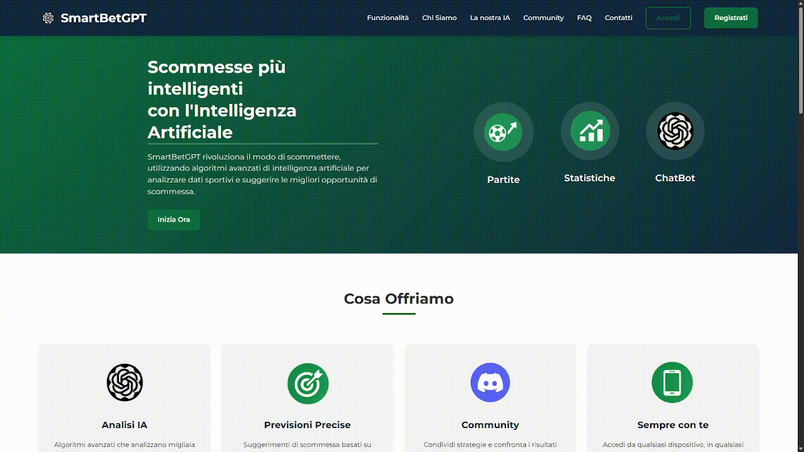

<div align="center">
  
  <h1>SmartBetGPT</h1>
</div>

SmartBetGPT è una piattaforma di scommesse sportive alimentata da intelligenza artificiale che fornisce analisi approfondite, previsioni e statistiche per aiutare gli utenti a prendere decisioni più informate sulle scommesse calcistiche.

<div align="center">
  
</div>

[](https://flask.palletsprojects.com/)
[](https://www.python.org/downloads/)
[](https://openrouter.ai/)
[](https://www.football-data.org/)
[](https://discord.gg/smartbetgpt)

## Funzionalità principali

- **Chatbot AI per scommesse**: Un assistente AI avanzato (Deepseek tramite OpenRouter) che analizza i dati calcistici e fornisce suggerimenti di scommessa personalizzati.
- **Analisi delle partite in tempo reale**: Monitoraggio delle partite imminenti con statistiche dettagliate e probabilità per i prossimi 7 giorni.
- **Dashboard personalizzata**: Interfaccia utente intuitiva per accedere rapidamente alle principali funzionalità.
- **Dati calcistici aggiornati**: Integrazione con l'API Football-data.org per ottenere dati aggiornati su partite, squadre e competizioni.
- **Sistema di registrazione e autenticazione**: Registrazione utente sicura con password criptate, conferma via email e ripristino password.
- **Notifiche email personalizzate**: Comunicazioni automatiche tramite email per aggiornamenti importanti e conferme.
- **Design responsive**: Interfaccia utente moderna che funziona perfettamente su desktop e dispositivi mobili.

## Tecnologie utilizzate

- **Backend**: Flask, SQLAlchemy, Python 3.8+
- **Frontend**: HTML, CSS, JavaScript, Jinja2
- **Database**: SQLite (configurabile anche con MySQL)
- **AI**: Integrazione con OpenRouter API che supporta vari modelli LLM (GPT-3.5, Claude, PaLM, ecc.)
- **Dati sportivi**: API Football-data.org
- **Autenticazione**: Flask-Login
- **Email**: Flask-Mail
- **Forms**: Flask-WTF, WTForms

## Dipendenze necessarie

- Python 3.8 o superiore
- Flask 2.2.3
- Flask-SQLAlchemy 3.0.3
- Flask-Login 0.6.2
- Flask-WTF 1.1.1
- Flask-Mail 0.9.1 (per la gestione delle email)
- Email-Validator 2.0.0.post2
- Werkzeug 2.2.3
- Python-dotenv 1.0.0
- Requests 2.28.2 (per le chiamate API)
- Altre dipendenze specificate nel file `requirements.txt`

## Configurazione delle variabili d'ambiente

Crea un file `.env` nella directory principale del progetto con i seguenti contenuti:
```
SECRET_KEY=la_tua_chiave_segreta
MAIL_SERVER=smtp.gmail.com
MAIL_PORT=587
MAIL_USE_TLS=True
MAIL_USERNAME=il_tuo_indirizzo_email@gmail.com
MAIL_PASSWORD=la_tua_password_app
MAIL_DEFAULT_SENDER=il_tuo_indirizzo_email@gmail.com
OPENROUTER_API_KEY=la_tua_chiave_api_openrouter
FOOTBALL_API_KEY=la_tua_chiave_api_football_data
```

> **Nota sulla sicurezza**: Per Gmail, devi usare una "password per le app" invece della tua password normale. Puoi generarla nelle impostazioni di sicurezza del tuo account Google.

## Come accedere a SmartBetGPT

Esistono tre modi per avviare e accedere a SmartBetGPT:

### Windows


1. Esegui il file `setup_and_run.bat` con un doppio clic
2. Il sistema automaticamente:
   - Creerà un ambiente virtuale Python
   - Installerà tutte le dipendenze necessarie
   - Creerà il database
   - Avvierà l'applicazione
3. Accedi tramite browser all'indirizzo: http://localhost:5000

### Linux/macOS


1. Apri un terminale nella cartella del progetto
2. Rendi eseguibile lo script: `chmod +x setup_and_run.sh` 
3. Esegui lo script: `./setup_and_run.sh`
4. Il sistema automaticamente:
   - Creerà un ambiente virtuale Python
   - Installerà tutte le dipendenze necessarie
   - Creerà il database
   - Avvierà l'applicazione
5. Accedi tramite browser all'indirizzo: http://localhost:5000

### Via Web

Accedi direttamente alla versione online tramite il seguente URL:
[smartbetgpt.me](https://smartbetgpt.me)

## Struttura del progetto

```
PaginaRegistrazione/
├── app.py                  # File principale dell'applicazione Flask
├── config.py               # Configurazioni dell'applicazione
├── create_db.py            # Script per la creazione del database
├── database.db             # Database SQLite
├── requirements.txt        # Dipendenze Python
├── models/                 # Modelli di dati
│   └── match.py            # Modello per le partite
├── services/               # Servizi per la logica di business
│   └── match_service.py    # Servizio per la gestione delle partite
├── static/
│   ├── css/
│   │   └── style.css       # Fogli di stile CSS
│   ├── img/                # Immagini e loghi
│   │   └── smartbetgpt.png # Logo principale
│   └── js/
│       └── script.js       # Script JavaScript
└── templates/              # Template HTML Jinja2
    ├── 404.html            # Pagina di errore 404
    ├── 500.html            # Pagina di errore 500
    ├── chatbot.html        # Interfaccia chatbot AI
    ├── contact.html        # Pagina di contatto
    ├── dashboard.html      # Dashboard utente
    ├── index.html          # Pagina principale
    ├── layout.html         # Layout base
    ├── login.html          # Pagina di login
    ├── match_details.html  # Dettagli partita
    ├── matches.html        # Lista partite
    ├── register.html       # Pagina di registrazione
    └── statistics.html     # Statistiche
```

### Spiegazione dettagliata delle cartelle

Di seguito viene fornita una descrizione dettagliata di ciascuna directory e del suo scopo all'interno del progetto:

#### `/forms`
Questa directory contiene tutti i moduli di form utilizzati per la gestione dell'input utente:
- **`auth_forms.py`**: Contiene i form per la registrazione, login, recupero password e reset password
- **`contact_forms.py`**: Gestisce il form di contatto per inviare messaggi di supporto

#### `/models`
Contiene la definizione dei modelli di dati, rappresentando il layer di persistenza dell'applicazione:
- **`user.py`**: Definisce il modello utente con proprietà come email, nome, password (hash) e stato di conferma
- **`match.py`**: Rappresenta le partite di calcio con tutti i dati relativi (squadre, risultati, statistiche)

#### `/routes`
Gestisce tutti i percorsi URL dell'applicazione, organizzati per aree funzionali:
- **`auth_routes.py`**: Gestisce percorsi di autenticazione (login, registrazione, recupero password)
- **`main_routes.py`**: Percorsi principali come homepage, dashboard, pagine informative
- **`match_routes.py`**: Percorsi per visualizzazione partite e statistiche
- **`chatbot_routes.py`**: Gestisce l'interfaccia del chatbot AI
- **`api_routes.py`**: Fornisce endpoint API per l'accesso programmatico ai dati

#### `/services`
Contiene i servizi che implementano la logica di business dell'applicazione:
- **`email_service.py`**: Servizio per l'invio di email (conferme, notifiche, reset password)
- **`football_service.py`**: Integrazione con l'API Football-data.org per recuperare dati sulle partite
- **`match_service.py`**: Logica di business per l'analisi e l'elaborazione dei dati delle partite
- **`openrouter_service.py`**: Integrazione con OpenRouter API per le funzionalità AI

#### `/static`
Risorse statiche dell'applicazione web:
- **`/css`**: Fogli di stile per l'interfaccia utente
- **`/js`**: Script JavaScript per funzionalità frontend e interattività
- **`/img`**: Immagini, loghi e risorse grafiche dell'applicazione

#### `/templates`
Template HTML Jinja2 per il rendering delle pagine web:
- **Template di autenticazione**: `login.html`, `register.html`, `forgot_password.html`, `reset_password.html`
- **Template di email**: `confirmation_email.html`, `welcome_email.html`, `password_reset_email.html`
- **Template core dell'applicazione**: `dashboard.html`, `matches.html`, `statistics.html`, `chatbot.html`
- **Template di sistema**: `layout.html` (base template), `404.html`, `500.html` (pagine di errore)

#### `/illustrations`
Contiene materiale grafico dimostrativo, come GIF e immagini per la documentazione del progetto.

#### `/instance`
Directory per i file specifici dell'istanza dell'applicazione, come database e file di configurazione locali che non vengono inclusi nel controllo versione.

#### File principali nella directory root
- **`app.py`**: Entry point dell'applicazione Flask
- **`config.py`**: Configurazioni centralizzate dell'applicazione
- **`create_db.py`**: Script per inizializzare il database
- **`update_db.py`**: Script per aggiornare la struttura del database
- **`setup_and_run.sh`**: Script di avvio per Linux/macOS
- **`setup_and_run.bat`**: Script di avvio per Windows
- **`requirements.txt`**: Elenco delle dipendenze Python

## Funzionalità chiave in dettaglio

### Sistema di gestione email con Flask-Mail

<div align="center">
  
</div>

La piattaforma utilizza Flask-Mail per offrire un'esperienza utente completa:

- **Email di benvenuto** inviate automaticamente alla registrazione
- **Verifica dell'account** tramite link di conferma email
- **Sistema di recupero password** sicuro tramite token temporanei
- **Notifiche personalizzate** per eventi importanti

### Sistema di autenticazione completo

<div align="center">
  
</div>

- Registrazione con validazione dei dati
- Login sicuro con protezione contro attacchi brute force
- Gestione delle sessioni utente
- Ripristino password via email
- Profili utente personalizzabili

### Integrazione con API Football-data.org

<div align="center">
  
</div>

L'applicazione utilizza l'API Football-data.org per ottenere:

- Statistiche dettagliate sulle competizioni (Serie A, Premier League, La Liga, ecc.)
- Partite in programma nei prossimi 7 giorni
- Risultati storici e performance delle squadre
- Probabilità e quote

### Assistente AI tramite OpenRouter

<div align="center">
  
</div>

La piattaforma utilizza il modello Deepseek tramite l'API OpenRouter per:

- Analisi personalizzate delle partite
- Consigli basati su statistiche storiche e recenti
- Risposta a domande sul calcio e sulle scommesse
- Supporto per vari modelli AI disponibili tramite abbonamento OpenRouter

## Comunità Discord SmartBetGPT

Unisciti alla nostra comunità di appassionati su Discord:
[Discord SmartBetGPT](https://discord.gg/smartbetgpt)

Nella nostra community potrai:
- Confrontare le tue analisi con altri utenti
- Discutere delle partite imminenti e delle statistiche
- Ricevere supporto tecnico per l'uso della piattaforma
- Contribuire allo sviluppo con suggerimenti e feedback

## Personalizzazione

- **Aspetto grafico**: Modifica i file in `static/css/` per personalizzare l'interfaccia.
- **Template**: Tutti i template HTML sono nella cartella `templates/` e possono essere personalizzati.
- **Modelli AI**: Puoi modificare o passare a qualsiasi modello disponibile su OpenRouter modificando la configurazione.
- **Competizioni calcistiche**: Aggiungi o modifica le competizioni seguite tramite l'API Football-data.org.

## Licenza

Questo progetto è rilasciato sotto licenza MIT.

## Crediti

Sviluppato come piattaforma che integra Flask con API di intelligenza artificiale (Deepseek/OpenRouter) e dati sportivi in tempo reale (Football-data.org) per fornire analisi calcistiche avanzate.
